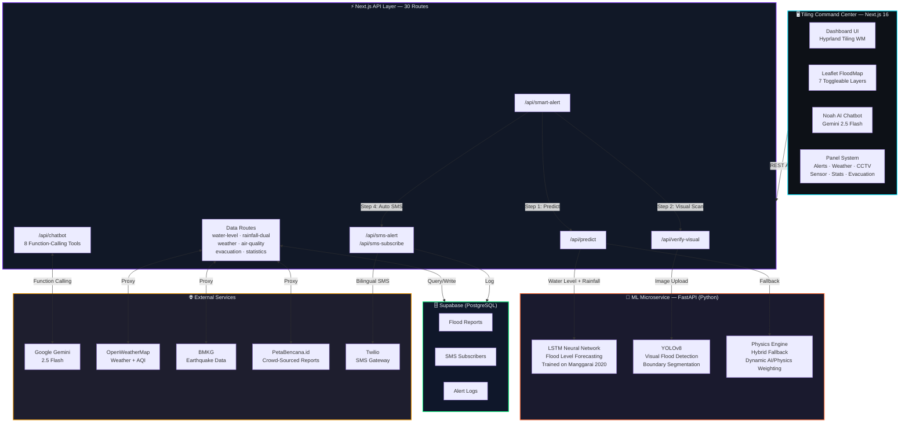
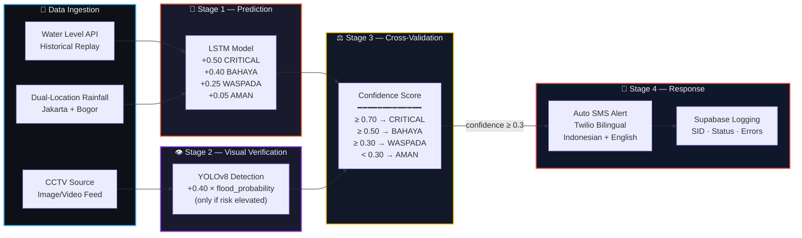
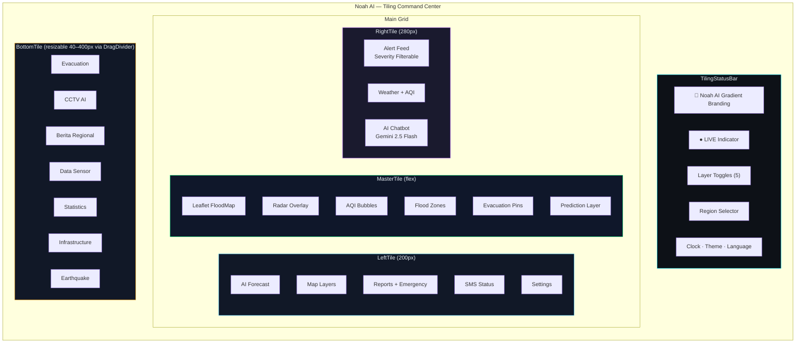

<div align="center">

# 🌊 Noah AI

**AI-Powered Flood Intelligence Platform for ASEAN**

Real-time flood monitoring, hybrid LSTM + physics prediction, YOLOv8 visual verification, Gemini-powered AI chatbot, and Twilio SMS alerts — unified in a Hyprland-inspired tiling command center.

📄 <a href="https://drive.google.com/drive/folders/1Wkn_Pt7N3k_vM1OzjFqGrQAOia3LisJr?usp=sharing">Full Report</a> · 🌐 <a href="https://noah-pi-umber.vercel.app/dashboard">Deployed Website</a> · 🎬 <a href="https://youtu.be/ZSLqQ2QtJgY">Demo Video</a>

[](https://nextjs.org/)
[](https://www.typescriptlang.org/)
[](https://python.org/)
[](https://tailwindcss.com/)
[](https://ai.google.dev/)
[](LICENSE)

### 👥 Team

**Moh Ari Alexander Aziz** · **Tiffany Viriya Chu** · **Jason Edward Salim** · **Putri Dzakiyah** · **Naufarrel Zhafif**

</div>

---


## Table of Contents

- [Overview](#overview)
- [Architecture](#architecture)
- [Tech Stack](#tech-stack)
- [Features](#features)
- [Getting Started](#getting-started)
- [Environment Variables](#environment-variables)
- [Scripts](#scripts)
- [Pages](#pages)
- [API Routes](#api-routes)
- [Project Structure](#project-structure)
- [Design System](#design-system)
- [Known Limitations](#known-limitations)
- [UN SDG Alignment](#un-sdg-alignment)
- [License](#license)

---

## Overview

**Noah AI** is a unified flood intelligence platform designed for ASEAN disaster response. It merges real-time monitoring with advanced AI in a **closed-loop** system:

1. **LSTM Neural Network** predicts water levels at key flood gates
2. **YOLOv8 Visual Verification** confirms rising waters from CCTV/photos
3. **Cross-Validation Engine** scores alert confidence (0.0–1.0) by merging both signals
4. **Twilio SMS Alerts** notify rural communities when risk is elevated

All of this is presented in a **Hyprland-inspired tiling window manager** dashboard — a dark, glassmorphic command center built for speed and information density.

### Why Noah AI?

| Problem | Noah AI Solution |
|---|---|
| Flood warnings arrive too late | Hybrid LSTM + physics engine predicts water levels ahead of time |
| Manual flood verification is slow | YOLOv8 detects floods from images/CCTV automatically |
| No unified view for responders | Tiling command center with map, alerts, weather, and AI in one screen |
| Rural communities lack internet | Bilingual SMS alerts via Twilio (Indonesian + English) |
| No intelligent assistant | Gemini 2.5 Flash chatbot with function calling (water data, weather, earthquake) |

---

## Architecture

### System Overview



### Closed-Loop AI Pipeline

The **Smart Alert Engine** cross-validates two independent AI signals to produce high-confidence flood alerts:



### Gemini AI Chatbot — Function-Calling Tools

> 🤖 Multi-turn function calling loop (up to 5 turns) with rate limiting (20 req/min) + safety filters.

| # | Tool | Description |
|---|---|---|
| 1 | `fetchWaterLevelData` | Hydrology post water levels |
| 2 | `fetchPumpStatusData` | Pump station operations |
| 3 | `fetchBmkgLatestQuake` | BMKG earthquake data |
| 4 | `fetchPetabencanaReports` | Crowd-sourced disaster reports |
| 5 | `geocodeLocation` | Location name → coordinates |
| 6 | `fetchWeatherData` | OpenWeatherMap current conditions |
| 7 | `requestUserLocation` | Browser geolocation trigger |
| 8 | `displayNotification` | Client-side toast popup |

### Tiling Dashboard Layout



### Pipeline Flow Summary

1. `/api/predict` fetches live water-level + dual-location rainfall → forwards to ML LSTM
2. `/api/smart-alert` runs LSTM prediction; if risk is elevated, triggers CCTV scan via YOLOv8
3. Cross-validation scoring: LSTM CRITICAL (+0.5) + YOLO flooded (+0.4 × flood probability)
4. If confidence ≥ 0.3 → auto-fires `/api/sms-alert` → Twilio sends bilingual SMS to all regional subscribers

---

## Tech Stack

### Frontend
| Technology | Purpose |
|---|---|
| **Next.js 16** (App Router) | React framework with server/client components |
| **TypeScript 5.2** | Type safety across the codebase |
| **Tailwind CSS 3.3** | Utility-first styling with custom dark theme tokens |
| **Leaflet + react-leaflet 4** | Interactive flood maps with 5 toggleable layers (Radar ↔ AQI mutually exclusive) |
| **Zustand 5** | Global state (map layers, location, UI) |
| **Framer Motion 11** | Animations (panel transitions, alerts, mobile sheet) |
| **Radix UI** | Accessible component primitives (19 packages) |
| **Recharts 3** | Data visualization and statistics charts |
| **React Hook Form + Zod** | Form validation (flood reports, SMS subscription) |
| **React Query** | Server state management and caching |
| **cmdk** | ⌘K Command palette for keyboard navigation |
| **Lucide React** | Icon library |

### Backend
| Technology | Purpose |
|---|---|
| **Next.js API Routes** | 32 server-side endpoints |
| **Supabase** | PostgreSQL database (flood reports, SMS subscribers, logs) |
| **Google Gemini 2.5 Flash** | AI chatbot with function calling (8 tools); safety filters on all AI routes |
| **Twilio** | SMS flood alerts for rural communities |
| **Sentry** | Error monitoring and observability |

### ML Service (Python)
| Technology | Purpose |
|---|---|
| **FastAPI** | ML API server (`/predict`, `/verify-visual`, `/health`) |
| **TensorFlow/Keras** | LSTM flood prediction model (trained on Manggarai 2020 data) |
| **YOLOv8 (Ultralytics)** | Visual flood boundary detection from images/CCTV |
| **Physics Engine** | Hybrid fallback with dynamic AI/physics weighting |

---

## Features

### 🖥️ Tiling Command Center (Hyprland-Inspired)

The default dashboard uses a **CSS Grid tiling window manager** layout:

- **TilingStatusBar** — Noah AI gradient branding, LIVE indicator, map layer toggles, region selector, clock, theme switch, language switcher
- **LeftTile (200px)** — Tabs: AI Forecast, Map Layers (5 toggles), Reports (with emergency contacts), SMS status, Settings
- **Master Tile** — Full Leaflet FloodMap with radar overlay, AQI bubbles, flood zones, evacuation pins, prediction layer
- **RightTile (280px)** — Tabs: Alert Feed (severity-filterable), Weather + AQI (OpenWeatherMap), AI Chat (Gemini)
- **BottomTile (resizable)** — 7 tabs: Evacuation (with click-to-expand detail modal: services, facilities, phone contact, Google Maps link), CCTV AI, Berita Regional, Data Sensor, Statistics, Infrastructure, Earthquake
- **DragDivider** — Resize bottom tile height (40–400px, persisted to localStorage)
- **MobileSheet** — Swipe-up drawer for mobile (<768px) with tabbed content

### 🤖 AI Integration

| Feature | Technology | Description |
|---|---|---|
| **Noah AI Chatbot** | Gemini 2.5 Flash | 8 function-calling tools: water levels, pump status, BMKG earthquake, PetaBencana reports, geocoding, weather, notifications, user location |
| **Flood Prediction** | LSTM + Physics | 3 modes: Auto (live data), Manual input, Demo Scenario |
| **Visual Verification** | YOLOv8 | Upload image → flood probability (0–100%) + detected objects |
| **Smart Alert** | Cross-validation | LSTM + YOLO → confidence score → auto SMS |
| **Flood Risk Forecast** | LeftTile widget | Client-side risk scoring: 0.5×LSTM + 0.3×rainfall + 0.2×CCTV. Station rankings with cascade delay estimates (Katulampa→Manggarai ~6h, Depok→Manggarai ~3h). |
| **AI Safety** | Gemini safety filters | All 3 Gemini endpoints (chatbot, flood-analysis, ai-alerts) enforce `BLOCK_MEDIUM_AND_ABOVE` on harassment, hate speech, sexual, and dangerous content. |

### 🗺️ Interactive Flood Map

| Layer | Toggle | Source |
|---|---|---|
| Radar Overlay | `showRadar` | Precipitation tiles |
| AQI Bubbles | `showAqi` | OpenWeatherMap Air Quality |
| Flood Zones | `showFloodZones` | PetaBencana.id crowd-sourced |
| Evacuation Pins | `showEvacPins` | API evacuation data |
| Weather Stations | `showWeatherStations` | Station locations |
| Prediction Layer | Auto | LSTM risk zone overlays |
| Disaster Reports | Auto | PetaBencana.id reports |

Additional map features:
- **Map Controls** — Zoom, fullscreen, search, filter, report flood
- **Flood Report Modal** — Zod-validated citizen report form (location, water level, photo)
- **Evacuation Routing** — Leaflet Routing Machine with turn-by-turn
- **Timeline Scrubber** — Historical data playback
- **Map Legend** — Dynamic legend for active layers

### 📡 Real-Time Data Integration

| Data Source | What It Provides |
|---|---|
| **OpenWeatherMap** | Current weather, forecast, AQI (5-level scale) |
| **BMKG** | Latest earthquake data for Indonesia |
| **PetaBencana.id** | Crowd-sourced disaster reports (floods, earthquakes) |
| **Water Level API** | Historical replay (Manggarai 2020) with dual-location rainfall |
| **Mock Sensors** | 100+ water level posts + pump stations (development) |

### 📲 SMS Alert System

- **Subscription** — Register phone number at `/sms-subscribe` with preferred region and language
- **Twilio Integration** — Bilingual SMS (Indonesian/English) capped at 160 chars
- **Smart Triggering** — Auto-fired by `/api/smart-alert` when risk ≥ WASPADA
- **Supabase Logging** — Every SMS logged with Twilio SID, status, and errors
- **Graceful Degradation** — Logs warning if Twilio not configured, never crashes

### 🌍 Multilingual Support

Full i18n with `LanguageContext` — English and Bahasa Indonesia. Language persisted via `useLocalStorage`.

---

## Getting Started

### Prerequisites

- **Node.js** 18+ and npm
- **Python** 3.10–3.12 (for ML service; 3.13 has TensorFlow issues on Windows)
- **Docker** & Docker Compose (optional)

### Option 1: Docker (Recommended)

```bash
docker-compose up --build
```

- **Frontend:** http://localhost:3000
- **ML API:** http://localhost:8000

### Option 2: Manual Setup

#### 1. Frontend

```bash
npm install
cp .env.example .env.local
# Edit .env.local with your API keys (see Environment Variables)
npm run dev
```

Open http://localhost:3000

#### 2. ML Service

```bash
cd ml-service
python -m venv venv

# Windows
venv\Scripts\activate

# macOS/Linux
source venv/bin/activate

pip install -r requirements.txt
uvicorn src.main:app --host 0.0.0.0 --port 8000
```

Set `ML_API_URL=http://localhost:8000` in `.env.local`.

### Windows Notes

<details>
<summary>TensorFlow long path fix</summary>

If `pip install` fails with path length errors:

1. **Enable long paths** (run PowerShell as Administrator):
   ```powershell
   New-ItemProperty -Path "HKLM:\SYSTEM\CurrentControlSet\Control\FileSystem" -Name "LongPathsEnabled" -Value 1 -PropertyType DWORD -Force
   ```
   Restart your computer.

2. **Or use a shorter venv path:**
   ```powershell
   python -m venv C:\ml-venv
   C:\ml-venv\Scripts\activate
   cd ml-service
   pip install -r requirements.txt
   ```
</details>

---

## Environment Variables

Copy `.env.example` to `.env.local` and configure:

| Variable | Required | Description |
|---|---|---|
| `NEXT_PUBLIC_SUPABASE_URL` | ✅ | Supabase project URL |
| `NEXT_PUBLIC_SUPABASE_ANON_KEY` | ✅ | Supabase anonymous key |
| `SUPABASE_SERVICE_ROLE_KEY` | ✅ | Supabase service role key |
| `OPENWEATHER_API_KEY` | ✅ | OpenWeatherMap API key |
| `GEMINI_API_KEY` | ✅ | Google Gemini API key |
| `ML_API_URL` | ✅ | ML service URL (e.g. `http://localhost:8000`) |
| `TWILIO_ACCOUNT_SID` | For SMS | Twilio account SID |
| `TWILIO_AUTH_TOKEN` | For SMS | Twilio auth token |
| `TWILIO_PHONE_NUMBER` | For SMS | Twilio sender phone number |
| `UPSTASH_REDIS_REST_URL` | Optional | Redis for rate limiting |
| `UPSTASH_REDIS_REST_TOKEN` | Optional | Redis auth token |
| `ADMIN_SECRET` | Optional | Admin secret for ML demo mode toggle |

---

## Scripts

| Command | Description |
|---|---|
| `npm run dev` | Start development server |
| `npm run build` | Production build |
| `npm run start` | Start production server |
| `npm run typecheck` | Run TypeScript type checking |
| `npm run lint` | Run ESLint |
| `npm run test` | Run Vitest tests |

---

## Pages

| Route | Description |
|---|---|
| `/` | Redirect → `/dashboard` |
| `/dashboard` | **Tiling Command Center** (default) or Classic view (`?layout=classic`) |
| `/alerts` | Full alert feed with severity categories |
| `/sensor-data` | Flood reports from Supabase + Statistics Dashboard |
| `/flood-predict` | LSTM prediction — Auto, Manual, and Demo Scenario modes |
| `/visual-verify` | YOLOv8 image upload for flood detection |
| `/flood-report` | Citizen flood report submission form |
| `/flood-map` | Standalone interactive flood map |
| `/evacuation` | Evacuation locations with routing |
| `/cctv-simulation` | CCTV AI monitoring (simulated feeds) |
| `/sms-subscribe` | SMS alert phone registration |
| `/current-weather` | Current weather conditions |
| `/weather-forecast` | Weather forecast |
| `/statistics` | Platform analytics and flood statistics |
| `/education` | 4 educational articles on flood preparedness |
| `/settings` | User preferences (theme, language, notifications) |
| `/contact` | Contact information |
| `/privacy` | Privacy policy |
| `/data-source` | Data source attribution and documentation |

---

## API Routes

### Core AI Pipeline (6 routes)

| Endpoint | Method | Description |
|---|---|---|
| `/api/predict` | POST | LSTM prediction proxy → ML service; Auto mode fetches live data |
| `/api/verify-visual` | POST | Image upload → YOLOv8 flood detection |
| `/api/smart-alert` | POST | Cross-validates LSTM + YOLO → confidence score → triggers SMS |
| `/api/cctv-scan` | POST | CCTV frame analysis |
| `/api/chatbot` | POST | Gemini 2.5 Flash with 7 function-calling tools |
| `/api/flood-analysis` | POST | AI flood situation analysis |

### Data & Monitoring (11 routes)

| Endpoint | Description |
|---|---|
| `/api/water-level` | Water level data (Manggarai historical replay) |
| `/api/rainfall-dual` | Dual-location rainfall (Jakarta + Bogor) |
| `/api/weather` | OpenWeatherMap current conditions proxy |
| `/api/weather-history` | Historical weather data |
| `/api/air-quality` | Air Quality Index data |
| `/api/sensor-simulator` | Simulated sensor data stream |
| `/api/disaster-proxy` | PetaBencana.id report proxy |
| `/api/disaster-reports` | Disaster report aggregation |
| `/api/evacuation` | Evacuation point data |
| `/api/regions` | Region metadata |
| `/api/statistics` | Dashboard statistics |

### Alerts & Communication (5 routes)

| Endpoint | Description |
|---|---|
| `/api/sms-alert` | Sends Twilio SMS to subscribers per region |
| `/api/sms-subscribe` | Phone subscription CRUD |
| `/api/alerts` | Active alerts feed |
| `/api/ai-alerts` | AI-generated alert summaries |
| `/api/news-summary` | Regional news aggregation |

### System (8 routes)

| Endpoint | Description |
|---|---|
| `/api/health` | System health check |
| `/api/ml-health` | ML service status (LSTM + YOLO readiness) |
| `/api/dashboard` | Dashboard aggregate data |
| `/api/scenarios` | Demo scenario list |
| `/api/scenarios/[id]` | Run specific demo scenario |
| `/api/preferences` | User preferences storage |
| `/api/flood-reports` | Flood report CRUD |
| `/api/analysis` | General analysis endpoint |

### ML Service Admin

| Endpoint | Description |
|---|---|
| `POST /admin/set-demo-mode` | Toggle ML demo mode (requires `ADMIN_SECRET` in request body) |

---

## Project Structure

```
flood/
├── app/                              # Next.js App Router
│   ├── api/                          # 32 API routes
│   │   ├── predict/                  # LSTM prediction proxy
│   │   ├── chatbot/                  # Gemini AI chatbot (function calling)
│   │   ├── smart-alert/              # Cross-validation engine (LSTM + YOLO)
│   │   ├── sms-alert/                # Twilio SMS sender
│   │   ├── verify-visual/            # YOLO image verification
│   │   ├── water-level/              # Water level data
│   │   ├── rainfall-dual/            # Dual-location rainfall
│   │   ├── weather/                  # OpenWeatherMap proxy
│   │   └── ...                       # 24 more routes
│   ├── dashboard/                    # Tiling command center
│   ├── flood-predict/                # LSTM prediction page (3 modes)
│   ├── visual-verify/                # YOLO verification page
│   ├── sensor-data/                  # Supabase flood reports + statistics
│   ├── evacuation/                   # Evacuation locations + routing
│   ├── sms-subscribe/                # SMS registration
│   ├── education/                    # 4 educational articles
│   ├── globals.css                   # Design tokens + dark theme
│   └── layout.tsx                    # Root layout (providers stack)
├── components/
│   ├── tiling/                       # Hyprland-inspired tiling system
│   │   ├── TilingLayout.tsx          # Main grid layout
│   │   ├── TilingStatusBar.tsx       # Top bar (Noah AI branding)
│   │   ├── LeftTile.tsx              # Forecast, layers, reports, SMS
│   │   ├── RightTile.tsx             # Alerts, weather, AI chat
│   │   ├── BottomTile.tsx            # 7-tab panel (955 lines)
│   │   ├── MobileSheet.tsx           # Mobile swipe-up drawer
│   │   ├── DragDivider.tsx           # Resize bottom tile
│   │   ├── RegionSelector.tsx        # Province → District dropdown
│   │   └── tiling.css                # Tiling CSS grid styles
│   ├── layout/                       # Shell components
│   │   ├── ClientLayoutWrapper.tsx   # Layout mode detection
│   │   ├── CommandCenterView.tsx     # Classic dashboard layout
│   │   ├── NavRail.tsx               # Left navigation (classic mode)
│   │   ├── StatusBar.tsx             # Top status bar (classic mode)
│   │   ├── SplashScreen.tsx          # Loading animation
│   │   └── CommandMenu.tsx           # ⌘K command palette
│   ├── map/                          # Map system (11 components)
│   │   ├── FloodMap.tsx              # Main Leaflet map (54K)
│   │   ├── MapControls.tsx           # Zoom, fullscreen, search
│   │   ├── MockAQILayer.tsx          # AQI visualization
│   │   ├── RadarLayer.tsx            # Precipitation radar
│   │   ├── TimelineScrubber.tsx      # Historical playback
│   │   └── WeatherInsightMap.tsx     # Weather data overlay
│   ├── flood-map/                    # Flood map features (12 components)
│   │   ├── PetaBanjirClient.tsx      # PetaBencana integration
│   │   ├── PredictionLayer.tsx       # LSTM risk zone overlay
│   │   ├── ReportFloodModal.tsx      # Flood report form
│   │   ├── MapFilterControl.tsx      # Layer filtering UI
│   │   └── MapActionsControl.tsx     # Map interaction actions
│   ├── contexts/                     # React contexts
│   ├── providers/                    # Provider components
│   ├── sensor-data/                  # Sensor data components
│   ├── dashboard/                    # Statistics dashboard
│   └── ui/                           # Radix-based component library
├── hooks/                            # 16 React hooks
│   ├── useWeatherData.ts             # Weather data fetching
│   ├── useAirPollutionData.ts        # AQI data
│   ├── useBmkgQuakeData.ts           # BMKG earthquake data
│   ├── useDisasterData.ts            # PetaBencana reports
│   ├── usePredictionData.ts          # ML prediction results
│   ├── useTheme.tsx                  # Theme management (4 themes)
│   ├── useMediaQuery.ts              # Responsive breakpoints
│   └── ...                           # 9 more hooks
├── lib/                              # Utilities and stores
│   ├── api.ts                        # API type definitions
│   ├── api.client.ts                 # Client-side API functions
│   ├── api.server.ts                 # Server-side API functions
│   ├── store.ts                      # Zustand app store
│   ├── mapLayerStore.ts              # Map layer toggle store
│   ├── constants.ts                  # Mock data, CCTV channels, alerts
│   ├── mock-data.ts                  # Water level + pump generators
│   ├── supabase/                     # Supabase client configuration
│   └── utils.ts                      # Shared utilities
├── ml-service/                       # Python ML microservice
│   ├── src/
│   │   ├── main.py                   # FastAPI app (predict, verify, scenarios)
│   │   ├── lstm_model.py             # LSTM flood forecaster
│   │   ├── yolo_model.py             # YOLOv8 visual verifier
│   │   ├── preprocessing.py          # Data preprocessing pipeline
│   │   ├── scenarios.py              # Demo scenarios
│   │   └── metrics.py                # Model metrics
│   ├── models/                       # Trained model weights (.h5, .pt)
│   ├── data/                         # Training/historical data
│   └── requirements.txt              # Python dependencies
├── src/
│   ├── context/LanguageContext.tsx    # i18n provider (EN/ID)
│   ├── i18n/                         # Translation files
│   └── lib/                          # Additional utilities
├── types/                            # TypeScript type definitions
├── public/                           # Static assets (icons, PWA manifest)
├── supabase/                         # Supabase configuration
└── tests/                            # Vitest test suite
```

---

## Design System

Noah AI uses a **dark, glassmorphic command center** aesthetic with CSS custom properties:

| Token | Dark Value | Purpose |
|---|---|---|
| `--cc-bg` | `#0a0e1a` | Page background |
| `--cc-surface` | `#111827` | Card/panel backgrounds |
| `--cc-elevated` | `#1a2236` | Elevated surfaces |
| `--cc-cyan` | `#00e5ff` | Primary accent |
| `--cc-critical` | `#ff1744` | Critical/danger status |
| `--cc-warning` | `#ff3d00` | Warning status |
| `--cc-caution` | `#ff9100` | Caution status |
| `--cc-safe` | `#00e676` | Safe/normal status |

### Typography
- **Space Grotesk** — UI text (headings, labels, body)
- **JetBrains Mono** — Code, data values, timestamps

### Themes
4 theme modes: **Dark** (default), **Light**, **System**, **High Contrast**

### UI Patterns
- Colored left borders on cards (severity-themed)
- Accent-colored labels for visual hierarchy
- Glassmorphic panels (`bg-white/[0.03]`, `border-white/5`)
- Pulsing LIVE indicators
- Severity-based color coding (red → yellow → emerald)

---

## Known Limitations

| Area | Status | Detail |
|---|---|---|
| LSTM Prediction | ⚠️ Falls back to physics | Model needs 62-feature preprocessing — currently simplified 3-feature input |
| CCTV Monitoring | ⚠️ Simulated | No live CCTV sources configured; uses demo channels |
| Infrastructure Data | ⚠️ Mock data | Water levels and pump status generated from mock-data functions |
| Supabase Data | ✅ With fallback | Falls back to mock data (50 reports) if Supabase has no records |
| SMS Alerts | ✅ Graceful | Works with Twilio; skips silently if not configured |
| AI Chatbot | ✅ Rate-limited | IP-based rate limiting (20 req/min) on chatbot, flood-analysis, ai-alerts, and predict endpoints |

---

## UN SDG Alignment

Noah AI directly supports the **ASEAN Capacity Building Roadmap 2025–2030** and targets:

| SDG | Goal | Noah AI Contribution |
|---|---|---|
| **SDG 9** | Industry, Innovation & Infrastructure | Real-time monitoring of flood mitigation assets (pumps, flood gates) |
| **SDG 11** | Sustainable Cities & Communities | Precision early warning for urban flood protection |
| **SDG 13** | Climate Action | AI-enhanced adaptive capacity to climate hazards |
| **SDG 17** | Partnerships for the Goals | Integrates PetaBencana.id, BMKG, OpenWeatherMap for regional collaboration |

---

## License

MIT — see [LICENSE](LICENSE) for details.
